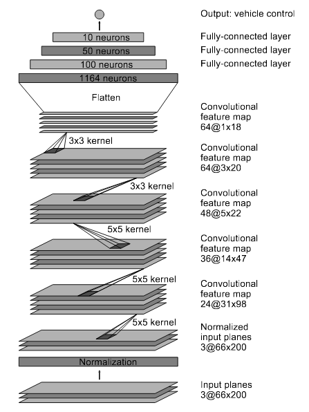
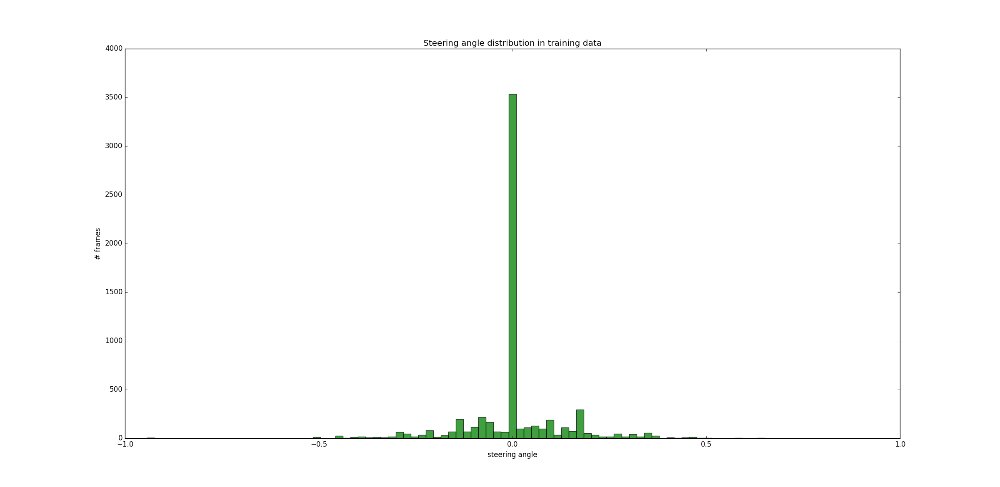

# **Behavioral Cloning**
---
### Overview

Using image data and steering angles, use deep neural networks and convolutional neural networks to clone driving behavior. Train, validate and test the model using Keras. Then use this model to drive a car autonomously around a race track.

The goals / steps of this project are the following:
* Use the simulator to collect data of good driving behavior
* Build, a convolution neural network in Keras that predicts steering angles from images
* Train and validate the model with a training and validation set
* Test that the model successfully drives around track one without leaving the road
* Summarize the results with a written report

[//]: # (Image References)

[image1]: ./CNN.png "Model Visualization"
[image2]: ./examples/placeholder.png "Grayscaling"
[image3]: ./examples/placeholder_small.png "Recovery Image"
[image4]: ./examples/placeholder_small.png "Recovery Image"
[image5]: ./examples/placeholder_small.png "Recovery Image"
[image6]: ./examples/placeholder_small.png "Normal Image"
[image7]: ./examples/placeholder_small.png "Flipped Image"

---

### Model Architecture and Training Strategy

#### Solution Design Approach

After reviewing the literature, the NVIDIA architecture was chosen to solve the problem. [NVIDIA Architecture](https://arxiv.org/pdf/1604.07316.pdf). The overall architecture is displayed below:

The model includes RELU layers to introduce nonlinearity, and the data is normalized in the model using a Keras lambda layer.

Convolutional layers are followed by 3 fully-connected layers: finally, a last single neuron tries to regress the correct steering value from the features it receives from the previous layers.

It has been test on the road on a much more open ended terrain (public roads) and empirically demonstrated it's feasibility, so it should be able to beat a simulator with ease.

#### Data Visualization

Before pre-processing, we are given three snapshots from three different perspectives.

Every frame is preprocessed by cropping the upper and lower part of the frame (not needed to predict the steering angle).

After exploring the dataset, it is clear that there is a large number of images with steering angle of zero.

#### Attempts to reduce overfitting in the model

The model contains multiple dropout layers after each convolutional layer and each fully-connected layer in order to reduce overfitting.

The model was trained and validated on different data sets and the car was driven backwards and off the track to recovery situations to prevent overfitting. The model was tested by running it through the simulator and ensuring that the vehicle could stay on the track.

#### Model parameter tuning

The model used an adam optimizer, so the learning rate was not tuned manually. During the training bias parameter was set to 0.8, frame brightness (V channel) was augmented in the range [0.2, 1.5] with respect to the original one. Normal distributed noise added to the steering angle had parameters mean=0, std=0.2. Frame flipping was random with probabililty 0.5.

#### Results & Recommendations

The result of the model applied to the car can be viewed here: https://youtu.be/-g2SErGJf4Q

This was a challenging project to get working, but the model was was able to successfully drive the car around the track autonomously. There are some issues with driving straight (it oscillates quite a bit during certain areas), but I believe this could be improved by adding more data for straight portions of the track.
